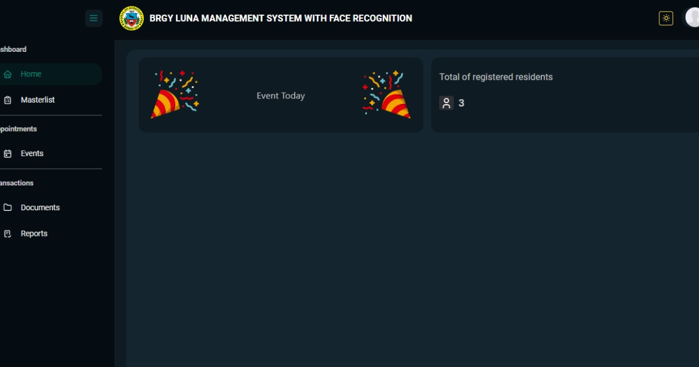
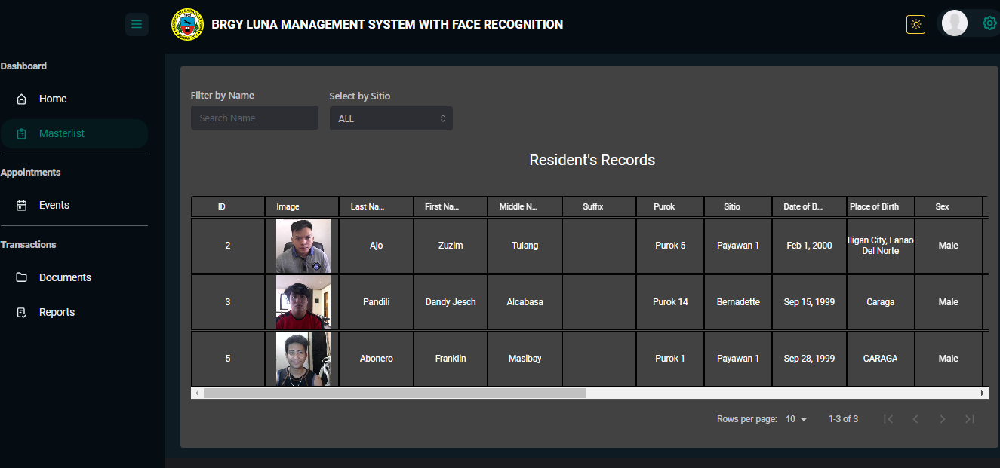
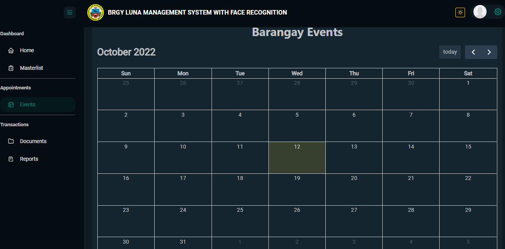
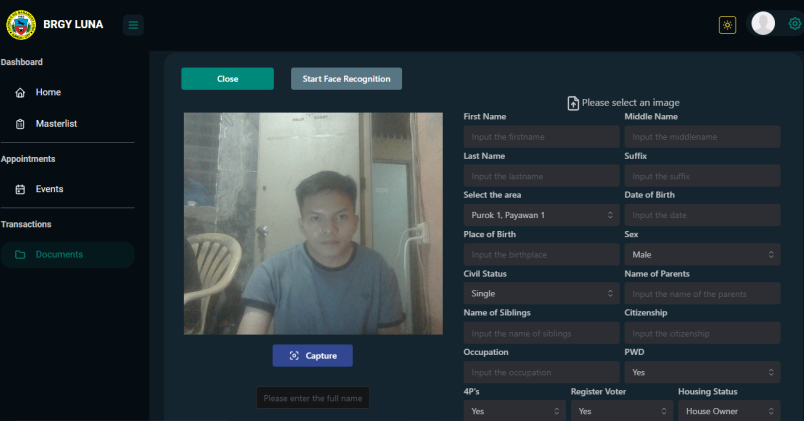
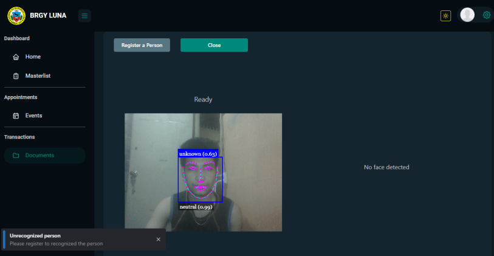
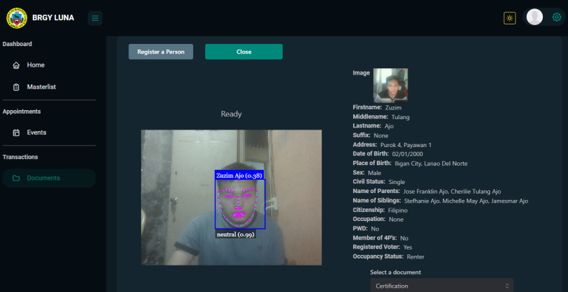
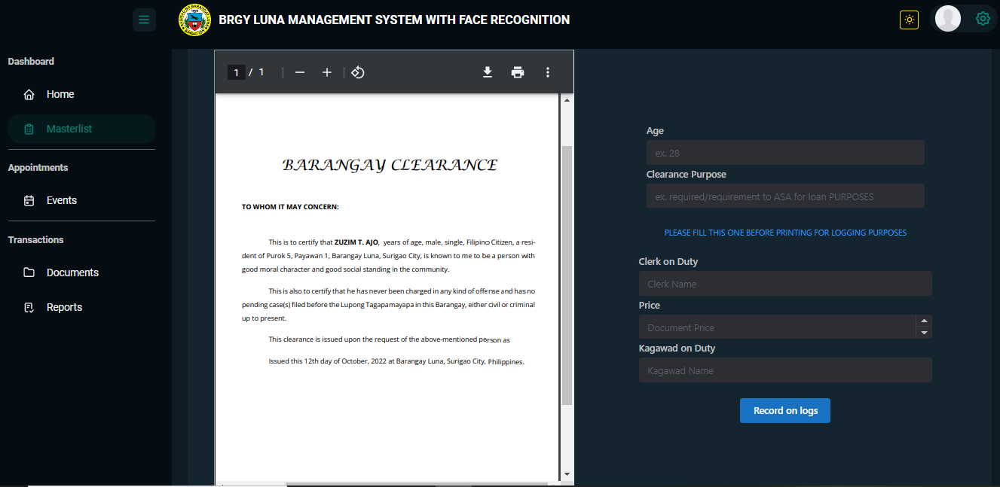
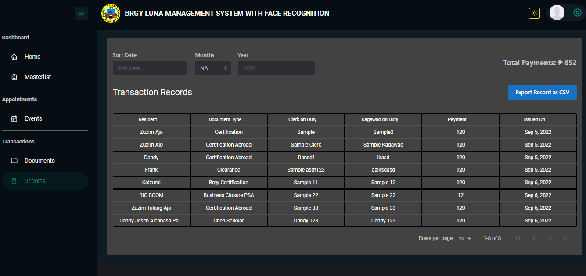

<h1 align="center"><a href='https://brgyluna-management-system.netlify.app/' target='_blank' rel='noreferrer'>Brgy Luna Management System with Face Recognition</a></h1>

<h2 align="center">Barangay Luna Management System with Face Recognition is an undergraduate thesis. It allows the admin to register the resident and issue barangay certificates using face recognition.
</h2>

## ⚒️ Built with the following technologies:

<ul>
    <li>React.js</li>
    <li>Mantine UI</li>
    <li>Face-api.js</li>
    <li>React-pdf</li>
    <li>Node.js</li>
    <li>Express.js</li>
    <li>MySQL</li>
    <li>Sequelize ORM</li>
    <li>Netlify 🚀</li>
</ul>

## ✨ Features

<ul>
    <li>Can use of face recognition for issuance of brgy certificates</li>
    <li>Has a masterlist data table that list all the residents of brgy</li>
    <li>Can record issuing transactions</li>
    <li>Can post upcoming events of brgy</li>
    <li>With theming support (Light/ Dark).</li>
</ul>

## 🖼️ Preview

<h3 align="center">Homepage</h3>
</img>
 
 
<h3 align="center">Masterlist</h3>
</imgs>
 
 
<h3 align="center">Events</h3>
</imgs>
 
 
<h3 align="center">Register</h3>
</imgs>
 
 
<h3 align="center">Shows unknown if unrecognized</h3>
</imgs>
 
 
<h3 align="center">The information will show if recognized, the admin can now select the brgy documents. The information of the resident will automatically written in the brgy certificate</h3>
</imgs>
 
 
<h3 align="center">Clearance Certificate</h3>
</imgs>
 
 
<h3 align="center">Reports</h3>
</imgs>
 
 
 
<h2 align="center">This research was built with my co-researchers Zuzim Ajo,Dandy Jesch Pandili, Franklin Abonero and special participation of Jeffrey Bernadas.</h2>

